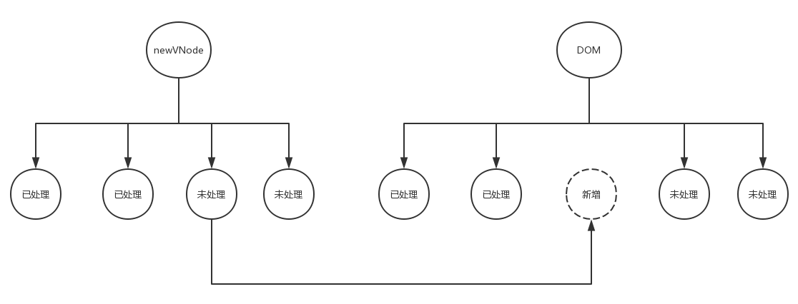
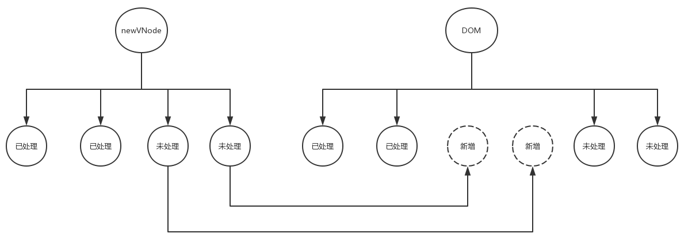
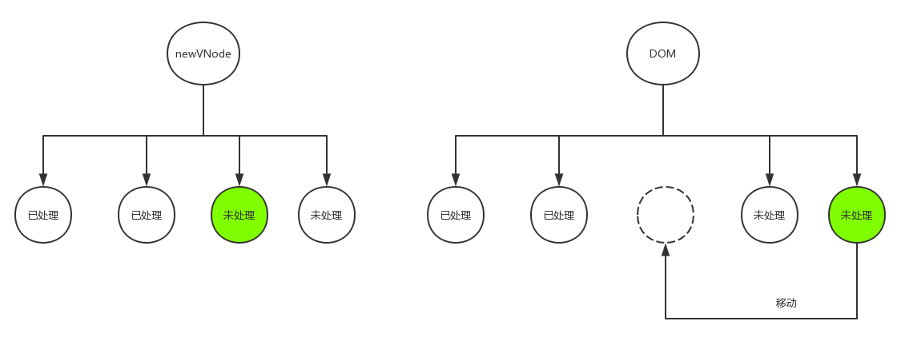

# 1.前言
在上一篇文章中，我们了解了vue中的patch过程，即dom-diff算法。并且知道了在patch过程中基本会干三件事，分别是：创建节点，删除节点，更新节点。创建节点和删除节点都比较简单，而更新节点因为要处理各种可能出现的情况所以逻辑比较复杂。

# 2.更新子节点
当新的vnode与旧的oldVNode都是元素节点并且包含子节点时，那么两个节点的vnode实例上的children属性就是包含的子节点数组。我们把新的vnode上的子节点数组标记为newChildren，把旧的oldVnode上的子节点标记为oldChildren，我们把newChildren里面的元素与oldChildren里的元素一一进行对比，对比两个子节点数组要通过循环，外层循环newChildren数组，内层循环oldChildren数组，每循环外层newChildren数组里的一个子节点，就去内层oldChildren数组里找看有没有与之相同的子节点，伪代码如下：
```javascript
for(let i = 0; i < newChildren.length; i++) {
  const newChild = newChildren[i]
  for(let j = 0; j < oldChildren.length; j++) {
    const oldChild = oldChildren[j]
    if (newChild === oldChild) {
      ...
    }
  }
}
```

那么上面这个过程会有一下四种情况：

* 创建子节点
  如果newChildren里面某个子节点在oldChildren里找不到与之相同的子节点，那么说明newChildren里面的这个子节点时之前没有的，时需要此次新增的节点，那就创建子节点。

* 删除子节点
  如果把newChildren里面每一个子节点都循环完毕后，返现在oldChildren还有未处理的子节点，那就说明这些未处理的子节点时需要被废弃的，那么久讲这些节点删除。

* 移动子节点
  如果newChildren里面的某个子节点在oldChildren里找到与之相同的子节点，但是所处的位置不同，这说明此次变化需要调整该子节点的位置，那么就以newChildren里的子节点的位置为基准，调整oldChildren里该节点的位置，使之与在newChildren里的位置相同。

* 更新节点
  如果newChildren里面的某个子节点在oldChildren里找到与之相同的子节点，并且所处的位置也相同，那么久更新oldChildren里该节点，使之与newChildren里该节点相同。

ok，到这里，逻辑就相对清晰了，接下来我们只需分门别类处理这四种情况就好。

# 3.创建子节点
如果newChildren里面的某个子节点在oldChildren里找不到与之相同的子节点，那么说明newChildren里面的这个子节点时之前没有的，时需要此次新增的节点，那么我们就创建这个节点，创建好之后再把它插入到DOM中合适的位置。  

创建节点这个很容易，我们上一篇已经介绍过，不在赘述。  

那么创建好之后如何插入到DOM中合适的位置呢？显然，把节点插入到DOM中时很容易的，找到合适的位置是关键。接下来我们分析一下如何找到这个合适的位置。如下图：

上图中左边是新的vnode，右边是旧的vnode，同时也是真实的dom。这个图意思是当我们循环newChildren里面的子节点，前两个子节点都在oldChildren里找到与之对应的子节点，那么我们将其处理，处理过后把他们标记为已处理，当循环到newChildren数组里第三个子节点时，发现在oldChildren里找不到与之对应的子节点，那么我们就需要创建这个节点，创建好之后我们发现这个节点本来是newChildren数组里左起第三个子节点那么我们就把创建好的节点插入到真实的DOM里第三个节点位置，也就是所有已处理节点之后。但是真的是这样吗？我们看下面这个图：


假设摩恩按照上面的方法把第三个节点插入到所有已处理节点之后，此时如果第四个节点在oldChildren中也找不到与之对应的节点，也是需要创建的节点，那么当我们把第四个节点也按照上面的方法插入到已处理节点之后，发现它被插入到第三个位置了，但是实际它应该是第四个！  

这就是问题所在，其实我们应该把新创建的节点插入到所有未处理节点之前，这样逻辑才正确。后面不过有多少个新增的节点，每一个都插入到所有未处理节点之前，位置就不会错。  

所以，**合适的位置是所有未处理节点之前，而非所有已处理节点以后**。  

# 4.删除子节点
如果把newChildren中每一个子节点都循环一遍，能在oldChildren数组里找到就处理它，找不到就新增，直到把newChildren里每个子节点都处理一遍，发现在oldChildren还存在未处理的子节点，那就说明这些未处理的子节点是需要被废弃的，那么就将这些节点删除。

# 5.更新子节点
如果newChildren里面的某个子节点在oldChildren里找到与之相同的子节点，并且位置也相同，那么久更新oldChildren里的该节点，使之于newChildren里的该节点相同。

# 6.移动子节点
如果newChildren里面的某个子节点在oldChildren中找到与之相同的子节点，但是所处的位置不同，这说明此次变化需要调整该子节点的位置，那么就以newChildren里的自己点位置为基准，调整oldChildren里该节点的位置，使之在newChildren里的位置相同。  

同样，移动一个节点并不难，关键在于移动到哪里，或者说关键在于移动到那个位置，这个位置才是关键。我们看下面的图：
  
在上图中，绿色的两个节点是相同的节点，但是所处的位置不同，即newChildren里面的第三个节点与真实DOM即oldChildren里面的第四个节点相同但是所处位置不同，按照上面所说的，我们应该以newChildren里面的节点的位置为基准，调整oldChildren里面该节点的位置，所以我们应该把真实DOM即oldChildren里面的第四个节点移动到第三个节点的位置，通过上图不难发现，所有未处理节点之前就是我们要移动的目标位置。如果此时你说那可不可以移动到所有已处理的节点之后呢？这个又回到更新节点时遇到的那个问题了：如果前面有新增的节点呢？  

# 7.回到源码
上面分析完所有的情况之后，我们回到源码看一下是不是这个样子，源码如下：
```javascript
//源码位置：/src/core/vdom/patch.js
//如果在oldChildren里找不到当前循环的newChildren里的子节点
if (isUndef(idxInOld)) {
  //新增节点病插入到合适的位置
  createElm(newStartVnode, insertedVnodeQueue, parentElm, oldStartVnode.elm, false, newCh, newStartIdx)
} else {
  //如果在oldChildren里找到了当前循环的newChildren里的子节点
  vnodeToMove = oldCh[idxinOld]
  //如果两个节点相同
  if (sameVnode(vnodeToMove, newStartVnode)) {
    //调用patchVnode更新节点
    patchVnode(vnodeToMove, newStartVnode, insertedVnodeQueue)
    oldCh[idxInOld] = undefined
    //canmove表示是否需要移动节点，如果为true，表示需要移动，则移动节点，否则不移动
    canMove && nodeOps.insertBefore(parentElm, vnodeToMove.elm, oldStartVnode.elm)
  }
}
```
上面代码中，首先判断在oldChildren里能否找到单签循环的newChildren里的子节点，如果找不到，那就是新增节点病插入到合适的位置；如果找到了，先对比两个节点是否相同，若相同则先调用patchVnode更新节点，更新完之后再看是否需要移动节点，注意，源码再判断是否需要移动子节点时用了简写的方式，下面两种写法时等价的：  
```javascript
canMove && nodeOps.insertBefore(parentElm, vnodeToMove.elm, oldStartVnode.elm)
//等同于
if (canMove) {
  nodeOpx.insertBefore(parentElm, vnodeToMove.elm, oldStartVnode.elm)
}
```

# 8.总结
最后，我们再思考一个问题，双层循环简单粗暴，虽然能解决问题，但是如果节点数目太多，这样循环算法的时间复杂度会不会很高？有没有什么优化方法，答案肯定是有了，下一篇文章我们来分析这个问题，就是当节点数目太多时vue如何优化算法。
