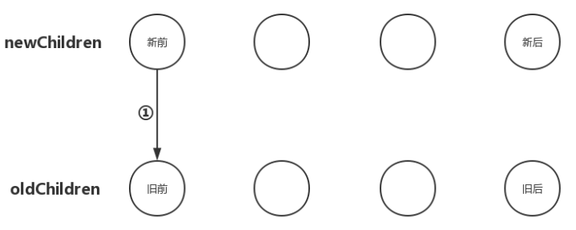
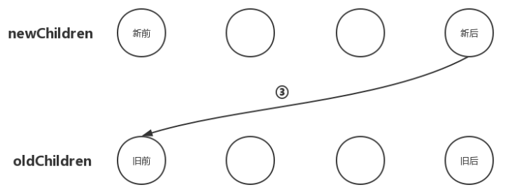
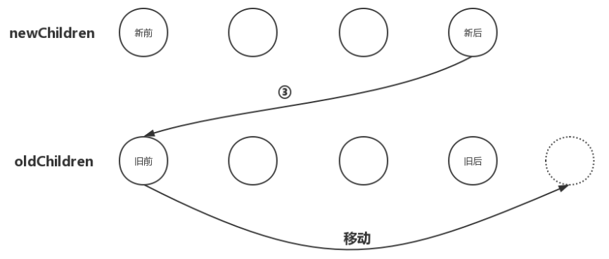
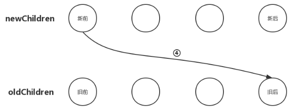
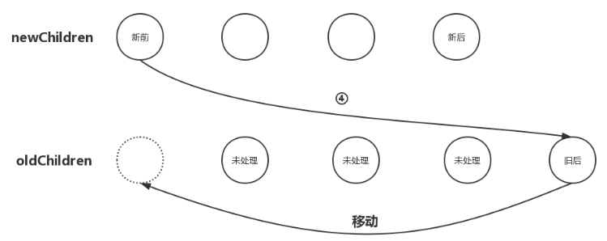

# 1.**前言**

当新的vnode与旧的vnode都是元素节点并且都有子节点的时候，vue会先循环外层newChildren数组元素，每循环外层newChildren数组里的一个子节点就去内层oldChildren数组里面找，看有没有与之相同的节点，进而根据情况作出不同的操作。  

当newChildren和oldChildren包含的子节点数量太多的时候，这样循环的时间复杂度就会变得很大，不利于性能提升。本篇我们就来学习一下vue如何针对这种情况进行优化的。


# 2.**优化策略介绍**
假设我们有一份新的newChildren数组和一份旧的oldChildren数组，如下所示：  
```javascript
newChildren = ['新子节点1', '新子节点2', '新子节点3', '新子节点4']
oldChildren = ['旧子节点1', '旧子节点2', '旧子节点3', '旧子节点4']
```

如果按照之前的解决方案，我们接下来的操作应该是这样的：从newChildren数组中拿出第一个子节点，用第一个子节点和oldChildren数组中的每个子节点进行比较，如果运气好，第一个旧的子节点刚好和第一个新的子节点相同，那就皆大欢喜，直接处理，不用再循环了。如果运气坏到极点，直到第四个旧的节点才比较出来和第一个新的节点相同，那么就会多循环4次。如果是最极端的情况，就是newChildren和oldChildren中的前三个节点是相同的，只有第四个节点是不同的，循环就会有16次比较，第16次循环的时候才发现第四个新节点和第四个旧节点不同，然后进行更新，如下图：  


# 3. **新前与旧前**
把newChildren数组里所有未处理的子节点的第一个子节点和oldChildren数组里所有未处理子节点的第一个子节点做对比，如果相同，那好极了，直接进入之前所说的更新节点操作并且由于新前与旧前的两个节点位置也相同，无需进行节点移动操作，如下。如果不同，继续往后尝试。


# 4. **新后与旧后**
把newChildren数组里所有未处理子节点的最后一个子节点和oldChildren数组里所有未处理子节点的最后一个子节点做对比，如果相同，那就直接进入更新节点的操作，并且由于新后与旧后两个节点的位置也下你沟通，无需进行节点移动操作；如果不同，继续往后尝试。


# 5. **新后与旧前**
把newChildren数组里所有未处理子节点的最后一个子节点和oldChildren数组里所有未处理的第一个子节点做对比，如果相同，那么久进入更新节点操作，更新完之后将oldChildren数组里的该节点移动到与newChildren数组里节点相同的位置；

此时，出现了移动节点的操作，移动节点最关键的地方在于找准要移动的位置。我们一再强调，更新节点要以新的vnode为基准，然后操作旧的oldVnode，使之最后旧的oldVnode与新的Vnode相同。那么现在的情况是：newChildren数组里最后一个子节点与oldChildren数组里的第一个子节点相同，那么我们应该在oldChildren数组里把第一个子节点移动到最后一个子节点的位置，如下图：


# 6. **新前与旧后**
把newChildren数组里所有未处理子节点的第一个子节点和oldChildren数组里所有未处理的子节点的最后一个子节点做对比，如果相同，那么就直接进入更新节点的操作，更新完成后再将oldChildren数组里的该节点移动到与newChildren数组里节点相同的位置。

同样，这种情况的节点移动位置逻辑与“新前与旧前”的逻辑类似，那就是newChildren数组里的第一个子节点与oldChildren数组里的最后一个子节点相同，那么我们就应该在oldChildren数组里把最后一个子节点移动到第一个子节点的位置，如下图：

从图中不难看出，我们要把oldChildren数组里把最后一个子节点移动到数组中所有未处理的节点之前。

OK，以上就是子节点对比更新优化策略的4中情况，如果以上4中情况以此试过之后仍然没有找到相同的节点，那就进再通过之前的循环方式查找。

# 7.**回到源码**
思路分析完，逻辑理清之后，回到源码再看看，验证一下源码实现的逻辑是否和上面分析的一样，源码如下：
```javascript
function updateChildren (parentElm, oldCh, newCh, insertedVnodeQueue, removeOnly) {
  let oldStartIdx = 0               // oldChildren开始索引
  let oldEndIdx = oldCh.length - 1   // oldChildren结束索引
  let oldStartVnode = oldCh[0]        // oldChildren中所有未处理节点中的第一个
  let oldEndVnode = oldCh[oldEndIdx]   // oldChildren中所有未处理节点中的最后一个

  let newStartIdx = 0               // newChildren开始索引
  let newEndIdx = newCh.length - 1   // newChildren结束索引
  let newStartVnode = newCh[0]        // newChildren中所有未处理节点中的第一个
  let newEndVnode = newCh[newEndIdx]  // newChildren中所有未处理节点中的最后一个

  let oldKeyToIdx, idxInOld, vnodeToMove, refElm

  // removeOnly is a special flag used only by <transition-group>
  // to ensure removed elements stay in correct relative positions
  // during leaving transitions
  const canMove = !removeOnly

  if (process.env.NODE_ENV !== 'production') {
    checkDuplicateKeys(newCh)
  }

  // 以"新前"、"新后"、"旧前"、"旧后"的方式开始比对节点
  while (oldStartIdx <= oldEndIdx && newStartIdx <= newEndIdx) {
    if (isUndef(oldStartVnode)) {
      oldStartVnode = oldCh[++oldStartIdx] // 如果oldStartVnode不存在，则直接跳过，比对下一个
    } else if (isUndef(oldEndVnode)) {
      oldEndVnode = oldCh[--oldEndIdx]
    } else if (sameVnode(oldStartVnode, newStartVnode)) {
      // 如果新前与旧前节点相同，就把两个节点进行patch更新
      patchVnode(oldStartVnode, newStartVnode, insertedVnodeQueue)
      oldStartVnode = oldCh[++oldStartIdx]
      newStartVnode = newCh[++newStartIdx]
    } else if (sameVnode(oldEndVnode, newEndVnode)) {
      // 如果新后与旧后节点相同，就把两个节点进行patch更新
      patchVnode(oldEndVnode, newEndVnode, insertedVnodeQueue)
      oldEndVnode = oldCh[--oldEndIdx]
      newEndVnode = newCh[--newEndIdx]
    } else if (sameVnode(oldStartVnode, newEndVnode)) { // Vnode moved right
      // 如果新后与旧前节点相同，先把两个节点进行patch更新，然后把旧前节点移动到oldChilren中所有未处理节点之后
      patchVnode(oldStartVnode, newEndVnode, insertedVnodeQueue)
      canMove && nodeOps.insertBefore(parentElm, oldStartVnode.elm, nodeOps.nextSibling(oldEndVnode.elm))
      oldStartVnode = oldCh[++oldStartIdx]
      newEndVnode = newCh[--newEndIdx]
    } else if (sameVnode(oldEndVnode, newStartVnode)) { // Vnode moved left
      // 如果新前与旧后节点相同，先把两个节点进行patch更新，然后把旧后节点移动到oldChilren中所有未处理节点之前
      patchVnode(oldEndVnode, newStartVnode, insertedVnodeQueue)
      canMove && nodeOps.insertBefore(parentElm, oldEndVnode.elm, oldStartVnode.elm)
      oldEndVnode = oldCh[--oldEndIdx]
      newStartVnode = newCh[++newStartIdx]
    } else {
      // 如果不属于以上四种情况，就进行常规的循环比对patch
      if (isUndef(oldKeyToIdx)) oldKeyToIdx = createKeyToOldIdx(oldCh, oldStartIdx, oldEndIdx)
      idxInOld = isDef(newStartVnode.key)
        ? oldKeyToIdx[newStartVnode.key]
        : findIdxInOld(newStartVnode, oldCh, oldStartIdx, oldEndIdx)
      // 如果在oldChildren里找不到当前循环的newChildren里的子节点
      if (isUndef(idxInOld)) { // New element
        // 新增节点并插入到合适位置
        createElm(newStartVnode, insertedVnodeQueue, parentElm, oldStartVnode.elm, false, newCh, newStartIdx)
      } else {
        // 如果在oldChildren里找到了当前循环的newChildren里的子节点
        vnodeToMove = oldCh[idxInOld]
        // 如果两个节点相同
        if (sameVnode(vnodeToMove, newStartVnode)) {
          // 调用patchVnode更新节点
          patchVnode(vnodeToMove, newStartVnode, insertedVnodeQueue)
          oldCh[idxInOld] = undefined
          // canmove表示是否需要移动节点，如果为true表示需要移动，则移动节点，如果为false则不用移动
          canMove && nodeOps.insertBefore(parentElm, vnodeToMove.elm, oldStartVnode.elm)
        } else {
          // same key but different element. treat as new element
          createElm(newStartVnode, insertedVnodeQueue, parentElm, oldStartVnode.elm, false, newCh, newStartIdx)
        }
      }
      newStartVnode = newCh[++newStartIdx]
    }
  }
  if (oldStartIdx > oldEndIdx) {
    /**
     * 如果oldChildren比newChildren先循环完毕，
     * 那么newChildren里面剩余的节点都是需要新增的节点，
     * 把[newStartIdx, newEndIdx]之间的所有节点都插入到DOM中
     */
    refElm = isUndef(newCh[newEndIdx + 1]) ? null : newCh[newEndIdx + 1].elm
    addVnodes(parentElm, refElm, newCh, newStartIdx, newEndIdx, insertedVnodeQueue)
  } else if (newStartIdx > newEndIdx) {
    /**
     * 如果newChildren比oldChildren先循环完毕，
     * 那么oldChildren里面剩余的节点都是需要删除的节点，
     * 把[oldStartIdx, oldEndIdx]之间的所有节点都删除
     */
    removeVnodes(parentElm, oldCh, oldStartIdx, oldEndIdx)
  }
}
```
# 8.**总结**