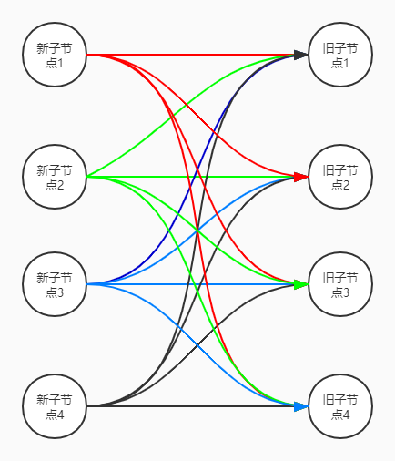

# 1.**前言**

当新的vnode与旧的vnode都是元素节点并且都有子节点的时候，vue会先循环外层newChildren数组元素，每循环外层newChildren数组里的一个子节点就去内层oldChildren数组里面找，看有没有与之相同的节点，进而根据情况作出不同的操作。  

当newChildren和oldChildren包含的子节点数量太多的时候，这样循环的时间复杂度就会变得很大，不利于性能提升。本篇我们就来学习一下vue如何针对这种情况进行优化的。


# 2.**优化策略介绍**
假设我们有一份新的newChildren数组和一份旧的oldChildren数组，如下所示：  
```javascript
newChildren = ['新子节点1', '新子节点2', '新子节点3', '新子节点4']
oldChildren = ['旧子节点1', '旧子节点2', '旧子节点3', '旧子节点4']
```

如果按照之前的解决方案，我们接下来的操作应该是这样的：从newChildren数组中拿出第一个子节点，用第一个子节点和oldChildren数组中的每个子节点进行比较，如果运气好，第一个旧的子节点刚好和第一个新的子节点相同，那就皆大欢喜，直接处理，不用再循环了。如果运气坏到极点，直到第四个旧的节点才比较出来和第一个新的节点相同，那么就会多循环4次。如果是最极端的情况，就是newChildren和oldChildren中的前三个节点是相同的，只有第四个节点是不同的，循环就会有16次比较，第16次循环的时候才发现第四个新节点和第四个旧节点不同，然后进行更新，如下图：  


# 3. **新前与旧前**

# 4. **新后与旧后**

# 5. **新后与旧前**

# 6. **新前与旧后**

# 7.**回到源码**

# 8.**总结**