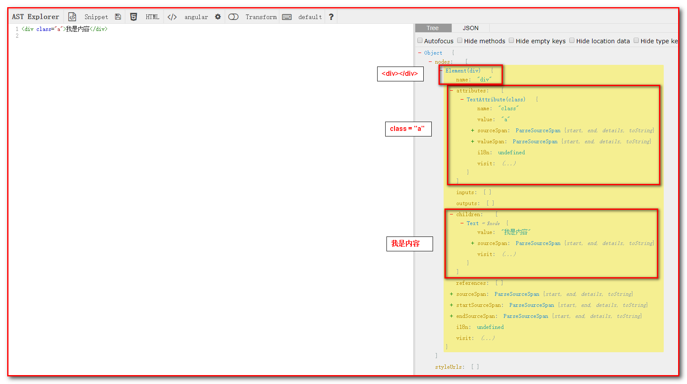

# 1.前言
再虚拟dom章节中介绍了虚拟DOM一级patch（补丁）的过程，虚拟dom从哪里来呢？vue编译器编译得到虚拟dom。这里我们介绍如何把用户编写的模板编译成虚拟dom（vnode）

# 2. 什么是模板编译
在vue的组件中`<template></template>`标签中有文本插值，指令v-on，v-bind，过滤器等，这些在原生的html语法中不被接受，vue的模板编译会吧这些非原生的html找出来生成render函数，render函数会把模板内容生成对应的VNode。VNode再经过patch过程得到新的VNode，最后生成真实的dom插入到视图中，完成视图渲染更新。

# 3.整体渲染流程
template模板经过一系列处理最终得到视图的过程称为整个渲染流程。流程图如下所示：


## 4.1 抽象语法树
从template的代码字符串中提取出元素的标签，属性，变量差值等有效信息需要借助一个工具：抽象语法树（AbstractSyntaxTree，AST）以树状形式表现编程语言的语法结构，树上的每个节点都标识源代码中的一种结构。这种语法不会表示真实语法的每个细节，例如嵌套括号被隐含在树的结构中，并没有以节点的形式呈现，if-else这样的 条件跳转语句可以使用两个分支的节点来表示。  
ast
在网站<https://astexplorer.net/>中可以输入一个div和文本看看被转化成抽象语法树之后的js对象，如下图：



## 4.2 具体流程
将一堆字符串解析成抽象语法书之后，就可以将其生成render函数了，有三个阶段：
1. 模板解析阶段：将一堆模板字符串用正则等方式解析成抽象语法树
2. 优化阶段：便利抽象语法树，找到静态节点，打上标记
3. 代码生成阶段：将抽象语法树转换成渲染函数

这三个阶段对应三个代码模块，源码路径如下：
1. 模板解析-解析器：`src/compiler/parser/index.js`
2. 优化-优化器：`src/compiler/optimizer.js`
3. 代码生成-打码生成器：`src/compiler/codegen/index.js`

```javascript
export const createCompiler = createCompilerCreator(function baseCompile(
  template: string,
  options: CompilerOptions
)): CompiledResult {
  //模板解析阶段：用正则等方式解析template模板中的指令，class，style等数据，生成AST
  const ast = parse(template.trim(), options)
  if (options.optimize !== false) {
    //优化阶段，遍历AST，找出其中的静态节点，并打上标记
    optimize(ast, options)
  }
  //代码生成阶段，将AST转换成渲染函数
  const code = generate(ast, options)
  return {
    ast,
    render: code.render,
    staticRenderFns: code.staticRenderFns
  }
}
```

可以看到baseCompile的核心代码非常简洁。

* **const ast = parse(template.trim(), options)**: parse会用正则等方式解析template模板中的指令，class，style等数据，形成AST。
* **optimize(ast, options)**: optimize的主要作用是标记静态节点，这是Vue在编译过程中的一次优化，当进行patch时，dom-diff算法会忽略静态节点，从而减少了比较过程，提高patch的效率。
* **const code = generate(ast, options)**: 将AST转化成render函数字符串的过程，得到的结果是render函数的字符串一级staticRenderFnx字符串。

流程图如下：


# 5.总结
模板编译生成虚拟DOM，根据虚拟DOM生成视图，最终渲染。模板编译有三个阶段，分别是模板解析阶段，优化节点，代码生成阶段。