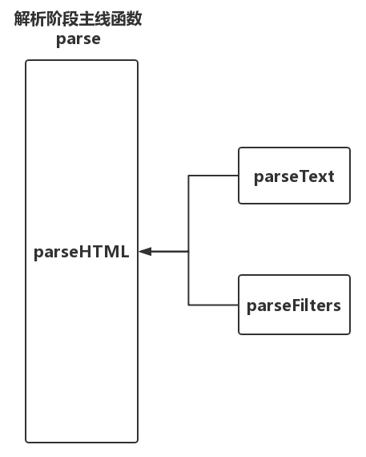

# 1.整体流程

解析器，把用户缩写的模板根据解析规则解析出有效信息，用这些信息生成AST。在template模板内部除了常规html标签外，还会有一些文本信息以及文本中的过滤器。不同的内容需要不同的解析器，除了常规的html解析器，还有解析文本的文本解析器以及解析过滤器的过滤器解析器等。  

html解析器是主线先用html解析器解析整个模板，解析过程中遇到文本内容，就用文本解析器来解析文本，碰到过滤器就使用过滤器解析器来解析。如下图：



# 2.回到源码
解析器源码位于`/src/compiler/parser`文件夹下，如下
```javascript
export function parse(template, options) {
  parseHTML(template, {
    warn,
    expectHTML: options.expectHTML,
    isUnaryTag: options.isUnaryTag,   //一元运算符
    canBeLeftOpenTag: options.canBeLeftOpenTag,
    shouldDecodeNewlines: options.shouldDecodeNewlines,
    shouldDecodeNewlinesForHref: options.shouldDecodeNewlinesForHref,
    shouldKeepComment: options.comments,
    start(tag, attrs, unary) {

    },
    end() {

    },
    chars(text: string) {

    },
    comment(text: string) {

    }
  })
  return root
}
```

从代码中可以看出，parse函数内调用了parseHTML函数对模板字符串进行解析，解析过程中如果遇到文本信息，就调用文本解析器parseText函数进行文本解析，如果包含过滤器，就调用过滤器解析器parseFilters函数进行解析。

# 3.总结
根据解析内容不同分为HTML解析器，文本解析器，过滤器解析器。