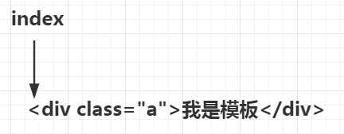
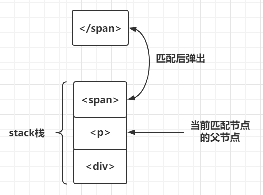

# 1.前言
三个不同的解析器中最主要的是是HTML解析器，它负责解析出模板字符串中有哪些内容，根据不同的内容调用其他的解析器。

# 2.HTML解析器内部运行流程
源码中HTML解析器就是parseHTML函数，这个函数接受两个参数，代码如下：

```javascript
/**
 * Convert HTML string to AST.
 * 将HTML模板字符串转化为AST
 */
export function parse(template, options) {
  parseHTML(template, {
    warn,
    expectHTML: options.expectHTML,
    isUnaryTag: options.isUnaryTag,
    canBeLeftOpenTag: options.canBeLeftOpenTag,
    shouldDecodeNewlines: options.shouldDecodeNewlines,
    shouldDecodeNewlinesForHref: options.shouldDecodeNewlinesForHref,
    shouldKeepComment: options.comments,
    // 当解析到开始标签时，调用该函数
    start (tag, attrs, unary) {

    },
    // 当解析到结束标签时，调用该函数
    end () {
    },
    // 当解析到文本时，调用该函数
    chars (text) {
    },
    // 当解析到注释时，调用该函数
    comment (text) {
    }
  })
  return root
}
```

传入的两个参数分别是：
* template：待转换的模板字符串
* options：转换时所需的选项
  
第一个参数是模板字符串，第二个参数提供一些解析HTML模板的参数，还有4个钩子函数：start，end，chars，comment。parseHTML用来解析模板字符串，这4个钩子函数吧提取出来的内容生成对应的AST。当解析器解析出不同的内容时调用不同的钩子函数从而生成不同的AST。

* 当前解析到开始标签时调用start函数生成元素类型的AST节点，代码如下：
```javascript
//当解析到标签的开始位置时，触发start
start(tag, attrs, unary) {
  let element = createASTElement(tag, attrs, currentParent)
}

export function creaeASTElement(tag, attrs, parent) {
  return {
    type: 1,
    tag,
    attrsList: attrs,
    attrsMap: makeAttrsMap(attrs),
    parent,
    children: []
  }
}
```
start函数接收单个参数，分别是标签名tag，标签属性attrs，标签是否自闭合unary。调用该钩子函数时，内部会调用careateASTElement函数来创建元素类型的AST节点。

* 当解析到结束标签时调用end函数

* 当解析到文本时调用chars函数生成文本类型的AST节点
```javascript
//当解析到文本时调用chars
chars(text) {
  if (text是文本变量的动态文本) {
    let emement = {
      type: 2,
      expression: res.expression,
      tokens: res.tokens,
      text
    }
  } else {
    let element = {
      type: 3,
      text
    }
  }
}
```
解析到标签的文本时，触发char钩子函数，在该钩子函数内部，先判断文本是否是一个带变量的动态文本，如果是，创建动态文本类型的AST节点，如果不是，则创建纯文本类型的AST节点。

* 当解析到注释时调用comment函数生成注释类型的AST节点
```javascript
//当解析到标签的注释时，触发comment
comment(text: string) {
  let element = {
    type: e,
    text,
    isComment: true
  }
}
```
解析到标签的注释时，触发comment钩子函数，该钩子函数会创建一个注释类型的AST节点。  
一边解析内容，一边调用对应的钩子函数生成AST节点，最终完成整个模板字符串的转化工作，这就是HTML解析器要做的工作。

# 3.如何解析不同的内容
从模板字符串中解析出不同的内容，首先要知道模板字符串中包含哪些内容，通常的模板字符串和HTML字符串类似，包含如下内容：
* 文本，例如”提交“
* HTML注释，例如\<!--注释内容-->
* 条件注释，例如\<!--[if !IE]-->
* DOCTYPE，例如\<!DOCTYPE html>
* 开始标签，例如\<div>
* 结束标签，例如\</div>

下面来分析HTML解析器如何从模板字符串中将不同的内容解析出来。

## 3.1 解析HTML注释
解析注释比较简单，HMTL注释时以`<!--`开头，以`-->`结束，这二者之间的内容就是注释内容，那么就需要使用正则表达式判断待解析的字符串`html`是否以`<!--`开始，若是，那就继续往后寻找`-->`，如果找到，注释就被解析出来。代码如下：
```javascript
const comment = /^<!\--/
if (comment.test(html)) {
  //若为注释，就继续往下查找是否存在‘-->’
  const commentEnd = html.indexOf('-->')
  if (commentEnd >= 0) {
    //若存在‘-->’，继续判断options中是否保留注释
    if (options.shouldKeepComment) {
      //若保留注释，则ba注释截取出来传给options.comment，创建注释类型AST节点
      options.comment(html.substring(4, commentEnd))
    }
    //若不保留注释，则将游标移动到‘-->’之后，继续向后解析
    advance(commentEnd + 3)
    contiunu
  }
}
```
上面代码中，如果模板字符串`html`符合注释开始的正则，那么就继续向后查找是否存在`-->`，若存在则把`html`从第4位（"<!--"长度为4）开始截取，直到`-->`处，截取到的内容就是注释的内容，然后调用comment钩子函数，将注释内容传入，创建注释类型的AST节点。  

上面代码中有一处值得注意的地方，那就是我们平常在模板中可以在`<template></template>`标签上配置`comments`选项来决定渲染模板时是否保留注释，对应到上面的代码中就是`options.shouldKeepComment`，如果用户配置了`comments`选项为true，则创建注释类型的`AST`节点，如不保留注释，则将游标移动到`-->`之后，继续向后解析。  

`advance`函数是用来移动解析游标的，解析完一部分就把游标向后移动一部分，确保不会重复解析，其代码如下：
```javascript
function advance(n) {
  index += n
  html = html.substring(n)
}
```
为了更加直观的说明advance的作用，看下图：


调用`advance`函数如下：
```javascript
advance(3)
```
得到结果：

从图中可以看出，解析游标index最开始在模板字符串的位置0处，调用了advance(3)之后，解析游标到了位置3处，每次解析完一段内容就将游标向后移动一段，借着再从解析游标向后解析，这样保证解析过程中html字符串不会不重复解析。

## 3.2 解析条件注释
解析条件注释和解析注释原理是一样的，也是用正则表达式盘点是否以条件注释开头，然后找其特有的结束标识，若找到则说明是条件注释，将其截取出来即可，由于条件注释不存在于真正的dom树中，所以不需要调用钩子函数创建AST节点。代码如下：
```javascript
//解析是否是条件注释
const conditionalComment = /^<!\[/
if (conditionalComment.test(html)) {
  //若果是条件注释，继续向后查找是否有结束字符
  const conditionalEnd = html.indexOf(']>')
  if (conditionalEnd >= 0) {
    //若存在’]>‘则从原本html字符串中把条件注释截取出来，把剩下的内容重新赋值给html，继续向后匹配
    advance(conditionalEnd + 2)
    continue
  }
}
```

## 3.3 解析DOCTYPE
解析DOCTYPE和前面两种原理完全相同，代码如下：
```javascript
const doctype = /^<!DOCTYPE [^>]+>/i
//判断是否是DOCTYPE
const doctypeMatch = html.match(doctype)
if(doctypeMatch) {
  advance(doctypeMatch[0].length)
  continue
}
```

## 3.4 解析开始标签
相较于前面三种解析，解析开始标签会复杂一些，但是原理还是使用正则表达式取匹配提取。
首先使用开始标签的正则去匹配模板字符串，看模板字符串中是否有开始标签的特征，如下：
```javascript
/**
 * 匹配开始标签的正则
 */
const ncname = '[a-zA-Z_][\\w\\-\\.]*'
const qnameCapture = `((?:${ncname}\\:)?${ncname})`
const startTagOpen = new RegExp(`^<${qnameCapture}`)

const start = html.match(startTagOpen)
if (start) {
  const match = {
    tagName: start[1],
    attrs: [],
    start: index
  }
}

//以开始标签开始的模板
'<div></div>'.match(startTagOpen)
// 执行结果：['<div', 'div', index: 0, input: '<div></div>']
//以结束标签开始的模板
'</div><div></div>'.match(startTagOpen)
//执行结果：null
//以文本开始的模板
'我是文本</p>'.match(startTagOpen)
//执行结果：null
```
上面的测试代码中，用不同的内容去匹配开始标签的正则，只有`<div></div>`可以匹配，并返回一个数组。

当解析到开始标签时，会调用4个钩子函数中的start函数，而start函数需要传递3个参数，分别是标签名tag，标签属性attrs，标签是否自动闭合unary。标签名是通过正则表达式获取到，就是上面的start[1]，而标签属性attrs和是否自闭合unary需要进一步解析。

1. 解析标签属性
   标签属性一般是写在开始标签的标签名字之后例如`<div class="a" id="b"></div>`，另外我们在上面匹配是否是开始标签的正则中已经可以拿到开始标签的标签名，机上面代码中的start[0]，现在可以ba这一部分从模板字符串中截掉，剩下的部分如下
   ```javascript
   class="a" id="b"></div>
   ```
   那么用剩下的这部分去匹配标签属性的正则，就可以把标签属性匹配出来了。
   ```javascript
   const attribute = /^\s*([^\s"'<>\/=]+)(?:\s*(=)\s*(?:"([^"]*)"+|'([^']*)'+|([^\s"'=<>`]+)))?/
   let html = 'class="a" id="b"></div>'
   let attr = html.match(attribute)
   console.log(attr)
   //执行结果：["class="a"", "class", "=", "a", undefined, undefined, index: 0, input: "class="a" id="b"></div>", groups: undefined]
   ```
   从执行结果看，第一个标签属性’class=”a“‘已经拿到。另外标签属性可能有多个也可能没有，没有的话匹配结果就是空，标签属性就是空数组；如果多个的话就需要循环匹配了，平匹配第一个标签属性后，就把该属性截掉，用身下的字符串继续匹配，知道不满足正则为止，代码如下：

   ```javascript
    const attribute = /^\s*([^\s"'<>\/=]+)(?:\s*(=)\s*(?:"([^"]*)"+|'([^']*)'+|([^\s"'=<>`]+)))?/
    const startTagClose = /^\s*(\/?)>/
    let html = 'class="a" id="b"></div>'
    const match = {
      tagName: start[1],
      attrs: [],
      start: index
    }
    while(!(end = html.match(startTagClose)) && (attr = html.match(attribute))) {
      advance(attr[0].length)
      match.attrs.push(attr)
    }
   ```

   上面代码的while循环中，如果剩下的字符串不符合开始标签的结果特征（startTagClose）并且符合标签属性的特征的话，那就说明还有未提取的标签属性，就进入循环，继续提取，知道把所有标签属性都提取完毕。

2. 解析标签是否自动闭合
   在html中，有自闭和标签（如``）也有非自闭合标签（如`<div></div>`）,这两种类型的标签在创建AST节点时处理方式有区别，所以需要解析当前标签是否是自闭和标签。
   解析方式也很简单，我们知道，经过标签属性提取之后，剩下的字符串无非就两种，如下：
   
   ```javascript
   //非自闭合标签
   ></div>
   ```
   或
   ```javascript
   //自闭合标签
   />
   ```
   用截取剩下的字符串去匹配开始标签结束符正则，如下：
   ```javascript
   const startTagClose = /^\s*(\/?)>/
   let end = html.match(startTagClose)
   '></div>'.match(startTagClose)
   //结果：[">", "", index: 0, input: "></div>", groups: undefined]
   '/>'.match(startTagClose)
   //结果：["/>", "/", index: 0, input: "/><div></div>", groups: undefined]
   ```
   可以看到，非自闭和标签匹配结果中的end[1]伟“”，而自闭合标签匹配结果汇总的end[1]是“”，可以根据匹配结果的end[1]是否为“”来判断当前标签是否是自闭合标签，代码如下：
   ```javascript
   const startTagClose = /^\s*(\/?)>/
   let end = html.match(startTagClose)
   if (end) {
    match.unarySlash = end[1]
    advance(end[0].length)
    match.end = index
    return match
   }
   ```
   经过以上两步，开始标签就已经解析完毕，完整源码如下：
   ```javascript
   const ncname = '[a-zA-Z_][\\w\\-\\.]*'
   const qnameCapture = `((?:${ncname}\\:)?${ncname})`
   const startTagOpen = new RegExp(`^<${qnameCapture}`)
   const startTagClose = /^\s*(/\?)>/

   function parseStartTag() {
    const start = html.match(startTagOpen)
    if (start) {
      const match = {
        tagName: start[1],
        attrs: [],
        start: index
      }
      advance(start[0].length)
      let end, attr
      /**
       * <div a=1 b=2 c=3></div>
       * 从<div之后到开始标签的结束符号’>‘之前，一直匹配属性attrs
       * 所有属性匹配完之后，html字符串还剩下自闭合标签剩下：’/>‘
       * 非自闭合标签还剩下：’></div>‘
       */
      while(!(end = html.match(startTagClose)) && (attr = html.match(attribute))) {
        advance(attr[0].length)
        match.attrs.push(attr)
      }

      /**
       * 这里判断了该标签是否为自闭合标签
       * 自闭合标签如：<input type="text"/>，非自闭合标签如：<div></div>，匹配的结果如下：
       * '></div>'.match(startTagClose) => [">", "", index: 0, input: "></div>", groups: undefined]
       * '/><div></div>'.match(startTagClose) => ["/>", "/", index: 0, input: "/><div></div>", groups: undefined]
       * 因此可以通过end[1]判断是否是’/‘来判断该标签是否是自闭合标签
       */
      if (end) {
        match.unarySlash = end[1]
        advance(end[0].length)
        match.end = index
        return match
      }
    }
   }
   ```
   通过源码可以看到，调用parseStartTag函数，如果模板字符串符合开始标签的特征，则解析开始标签，并将解析结果返回，如果不符合开始标签的特征，则返回undefined。  

   解析完毕，就可以用解析得到的结果去调用start钩子函数去创建元素类型的AST节点了。在vue源码中，并没有直接调用start钩子函数去创建AST节点，而是调用了handleStartTag函数，在该函数内部去调用start钩子函数。虽然经过parseStartTag函数已经把创建AST节点必要的信息提取出来了，但是提取出来的标签属性数组还需要处理一下，下面我们看一下handleStartTag函数到底做了什么事。源码如下：
   ```javascript
   function handleStartTag(match) {
    const tagName = match.tagName
    const unarySlash = match.unarySlash

    if (expectHTML) {
      //
    }

    const unary = isUnaryTag(tagName) || !!unarySlash
    const l = match.attrs.length
    for(let i = 0; i < l; i++) {
      const args = match.attrs[i]
      const value = args[3] || args[4] || args[5] || ''
      const shouldDecodeNewlines = tagName === 'a' && args[1] === 'href'
        ? options.shouldDecodeNewlinesForHref
        : options.shouldDecodeNewlines
      attrs[i] = {
        name: args[1],
        value: decodeAttr(value, shouldDecodeNewlines)
      }
    }

    if(!unary) {
      stack.push({tag: tagName, lowerCasedtag: tagName.toLowerCase(), attrs: attrs})
      lastTag = tagName
    }
    if(options.start) {
      options.start(tagName, attrs, unary, match.start, match.end)
    }
   }
   ```

   handleStartTag函数用来对parseStartTag函数的解析结果进行进一步处理，它接收parseStartTag函数的返回值作为参数。  

   handleSstartTag函数的开始定义几个常量：
   ```javascript
   const tagName = match.tagName        //开始标签的标签名
   const unarySlash = match.unarySlash  //是否为自闭合标签的标志，自闭和为“”，否则为“/”
   const unary = isUnaryTag(tagName) || !!unarySlash    //标志是否为自闭和标签
   const l = match.attrs.length         //match.attrs数组的长度
   const attrs = new Array(l)           //一个与match.attrs数组长度相等的数组
   ```

   接下来是循环处理提取出来的标签属性数组match.attrs，如下：

   ```javascript
    for(let i = 0; i < l; i++) {
      const args = match.attrs[i]
      const value = args[3] || args[4] || args[5] || ''
      const shouldDecodeNewlines = tagName === 'a' && args[1] === 'href'
        ? options.shouldDecodeNewlinesForHref
        : options.shouldDecodeNewlines
      attrs[i] = {
        name: args[1],
        value: decodeAttr(value, shouldDecodeNewlines)
      }
    }
   ```
   上面代码中，现定义了args常量，它的值是解析出来的标签属性数组中的每一个属性对象，即match.attrs数组中每个元素对象，如下：
   ```javascript
   const args = ["class="a"", "class", "=", "a", undefined, undefined, index: 0, input: "class="a" id="b"></div>", groups: undefined]
   ```

   接着定义了value，用于存储标签属性的属性值，在代码中尝试取args的args[3]， args[4]， args[5]，如果取不到，则给value复制为空

   ```javascript
   const value = args[3] || args[4] || args[5] || ''
   ```

   接着定义了shouldDecodeNewlines，这个常量主要是做一些兼容性处理，如果shouldDecodeNewlines为true，意味着vue在编译模板的时候要对属性值中的换行符或制表符做兼容处理。而shouldDecodeNewlinesForHref为true意味着vue在编译模板的时候，要对a标签的href属性中的换行符或制表符做兼容处理。

   ```javascript
   const shouldDecodeNewlines = tagName === 'a' && args[1] === 'href'
    ? options.shouldDecodeNewlinesForHref
    : options.shouldDecodeNewlinesconst
   ```

   将处理好的结果存入之前定义好的雨match.attrs数组长度相等的attrs数组中，如下：
   ```javascript
   attrs[i] = {
    name: args[1],  //标签属性的属性名，如class
    value: decodeAttr(value, shouldDecodeNewlines)  //标签属性的属性值，如class="a"
   }
   ```

   最后，如果该标签时非自闭和标签，则将变迁推入栈中，如下：

   ```javascript
   if (!unary) {
    stack.push({tag: tagName, lowerCasedTag: tagName.toLowerCase(), attrs: attrs})
    lastTag = tagName
   }
   ```

   如果该标签是自闭和的，可以调用start钩子函数并传入处理好的参数来创建AST节点，如下：

   ```javascript
   if(options.start) {
    options.start(tagName, attrs, unary, match.start, match.end)
   }
  ```

## 3.5 解析结束标签
结束标签的解析要比开始标签容易多了，因为不需要解析属性，只需要判断剩下的模板字符串是否符合结束标签的特征，如果是，就将结束标签提取出来，再调用4个钩子函数中的end函数就好了。

首先判断剩余的模板字符串是否符合结束标签的特征，如下：
```javascript
const ncname = '[a-zA-Z_][\\w\\-\\.]*'
const qnameCapture = `((?:${ncname}||:)?${ncname})`
const endTag = new RegExp(`^<\\/${qnameCapture}[^>]*>`)
'</div>'.match(endTag)
// ["</div>", "div", index: 0, input: "</div>", groups: undefined]
'<div>'.match(endTag)
// null
```

上面代码中，如果模板字符串符合结束标签的特征，则会获得匹配结果数组，如果不符合，则得到null。  

接着调用end钩子函数，如下：
```javascript
if (endTagMatch) {
  const curIndex = index
  advance(endTagMatch[0].length)
  parseEndTag(endTagMatch[1], curIndex, index)
  continue
}
```
上面代码中，没有直接调用end函数，而是调用parseEndTag函数，关于parseEndTag函数内部的作用我们后面会介绍到，可以暂时理解为该函数内部去调用了end钩子函数。

## 3.6 解析文本
前面五种类型都是以’<‘开头的，只有文本类型的内容不是，所以解析模板字符串的时候判断是不是以’<‘开通，如果是，就是以上五种类型，否则就是文本。解析模板字符串之前先查找一下第一个’<‘出现的位置，如果第一个不是'<'说明模板字符串是以文本开头的，那么从开头到第一个’<‘出现的位置就是就都是文本内容了。如果在整个模板字符串没有找到’<‘，那说明整个模板字符都是文本。这就是解析文本的思路，对照源码看一下。

```javascript
let textEnd = html.indexOf('<')
if (textEnd === 0) {

}
if (textEnd >= 0) {
  //如果html字符串不是以'<'开头，说明前面都是纯文本嗯，无需处理，就报’<‘后面的内容拿出来赋值给rest
  rest = html.slice(textEnd)
  while(
    !endTag.test(rest) &&
    !startTagOpen.test(rest) &&
    !comment.test(rest) &&
    !conditionalComment.test(rest)
  ) {
    /**
     * 用’<‘以后的内容rest去匹配endTag，startTagOpen，comment，conditionComment，如果匹配不上表示'<'是属于文本本身的内容
     */
    //在'<'之后查找是否还有'<'
    next = rest.indexOf('<', 1)
    //如果没有了，表示'<'后面也是文本
    if (next < 0) break
    //如果还有，表示‘<’是文本中的一个字符
    textEnd += next
    //把next之后的内容截出来继续下一轮循环匹配
    rest = html.slice(textEnd)
  }
  // '<'是结束标签的开始，说明从开始到‘<’都是文本，截取出来
  text = html.substring(0, textEnd)
  advance(textEnd)
}

//整个模板字符串没有找到‘<’说明整个模板字符串都是文本
if (textEnd < 0) {
  text = html
  html = ''
}
//把截取出来的text转化成textAST
if (options.charts && text) {
  options.chars(text)
}
```
判断是否文本字符串逻辑很清晰，根据<不在第一个位置以及整个模板字符串里没有<分别进行处理。  

值得深究的是如果`<`不在第一个位置，而在模板字符串中间的某个位置，name说明模板字符串是以文本开头的，那么聪开头到第一个`<`出现的位置都是文本内容，接着我们还要从第一个`<`的位置继续向后判断，因为还存在这样的情况：如果文本里本来就包含一个`<`，例如`1<2</div>`。为了处理这种情况，我们把从第一个`<`的为孩子到模板字符串结束都截取出来作为rest，如下：
```javascript
let rest = html.slice(textEnd)
```

接着用rest去匹配以上5种类型的正则，如果匹配不上，则表明这个`<`是属于文本本身的内容，如下：
```javascript
while(
  !endTag.test(test) &&
  !startTagOpen.test(rest) &&
  !comment.test(rest) &&
  !conditionalComment.test(test)
)
```

如果都匹配不上，则表明这个`<`是属于文本本身的内容，接着以这个`<`的位置继续向后查找，看是否还有`<`，如果没有了，则表明后面的都是文本；如果后面还有下一个`<`，则表明至少在这个`<`到下一个`<`中间的内容都是文本，至于下一个`<`以后的内容是什么，则还需要重复以上的逻辑继续判断，代码如下：
```javascript
while(
  !endTag.test(test) &&
  !startTagOpen.test(rest) &&
  !comment.test(rest) &&
  !conditionalComment.test(test)
) {
  /**
   * 用‘<’以后的内容rest去匹配endTag，startTagOpen，comment，conditionalComment，如果都匹配不上，则表示`<`是属于文本本身的内容
   */
  //在`<`之后查找是否还有`<`
  next = rest.indexOf('<', 1)
  //如果没有了，则表示‘<’后面也是文本
  if (next < 0) break
  //如果还有，则表示‘<’是文本中的一个字符
  textEnd += next
  //那就把next之后的内容截出来继续下一轮循环匹配
  rest = html.slice(textEnd)
}
```
最后截取文本内容text，并调用4个钩子函数中的chars函数创建文本类型的AST节点。

# 4.如何保证AST节点层级关系
vue在html解析器的开头定义了一个栈stack，这个栈的作用就是用来维护AST节点的层级。HTML解析器在从前向后解析模板字符串时，每当遇到开始标签时就会调用start钩子函数，将开始标签推入栈中，遇到结束标签时就会调用end钩子函数，函数内部将解析得到的结束标签对应的开始标签从栈中弹出。例如，下面的html模板：
```html
<div><p><span></span></p></div>
```
当解析到开始标签`<div>`时，就把div推入栈中，然后继续解析，解析到<p>时，再把p推入栈中，同理，再把span推入栈中，当解析到结束标签</span>时栈顶是<span>，此时就用span的开始标签和结束标签构建AST节点，并且b从栈中把span的开始标签弹出，此时栈顶的标签p就是构建好的span的AST节点的父节点，如下图：



通过这个栈，就找到了被构建节点的父节点。此外，栈还可以检查标签是否被正确闭合，看下面的html模板：

```html
<div><p><span></p></div>
```
按照上面的流程，解析这个模板字符串的时候，当解析到结束标签</p>时，栈顶的标签应该是<p>才对，而现在是<span>，那就说明span标签没有被正确的闭合，此时控制台就会抛出警告：‘tag has no matching end tag’，意思是模板字符串中的标签没有被正确的闭合。


# 5.回归源码
## 5.1 HTML解析器源码
回归源码，逐句分析HTML解析器parseHTML函数，如下：

```javascript
function parseHTML(html, options) {
  var stack = []
  var exceptHTML = options.expectHTML
  var isUnaryTag$$1 = opitons.isUnaryTag || no
  var canBeleftOpenTag$$1 = options.canBeLeftOpentTag || no
  var index = 0
  var last, lastTag

  //开启一个while循环，结束条件是html为空，即html被parse完毕
  while(html) {
    last = html
    //确保即将被parse的内容不是在纯文本标签里（script, style, textarea）
    if (!lastTag || !isPlainTextElement(lastTag)) {
      let textEnd = html.indexOf('<')
      /**
       * 如果html字符串是以'<'开头，则有以下几种可能
       * 开始标签: <div>
       * 结束标签: </div>
       * 注释: <!---->
       * 条件注释: <!-- [if !IE] --> <!-- [endif] -->
       * DOCTYPE: <!DOCTYPE html>
       * 需要以此处理
       */
      if (textEnd == 0) {
        //是否是注释
        if (comment.test(html)) {

        }
        //解析是否是条件注释
        if (conditionalComment.test(html)) {

        }
        //解析是否是DOCTYPE
        const doctypeMatch = html.match(doctype)
        if (doctypeMatch) {

        }
        //解析是否是结束标签
        const endTagMatch = html.match(endTag)
        if (endTagMatch) {

        }
        //匹配是否是开始标签
        const startTagMatch = parseStartTag()
        if (startTagMatch) {

        }
      }
      //如果html字符串不是以‘<’开头，则解析文本类型
      let text, rest, next
      if (textEnd >= 0) {

      }
      //如果在html字符串中没有找到'<'，表示这一段html字符串是纯文本
      if (textEnd < 0) {
        text = html
        html = ''
      }
      //把截取出来的text转化成textAST
      if (options.chart && text) {
        options.chars(text)
      }
    } else {
      //父元素为script，style，textarea时，内部内容全部作为纯文本处理
    }

    //将整个字符串作为文本对待
    if (html == last) {
      options.chars && options.chars(html)
      if (!stack.length && options.warn) {
        options.warn(("Mal-formatted tag at end of template: \"" + html + "\""))
      }
      break
    }
  }

  //clean up and remaining tags
  parseEndTag()
  //parse 开始标签
  function parseStartTag() {

  }
  //处理parseStartTag的结果
  function handleStartTag(match) {

  }
  //parse结束标签
  function parseEndTag(tagName, start, end) {

  }
}
```

上述代码可以分为三个部分：
- 定义一些常量和变量
- while循环
- 解析过程用到的辅助函数

首先定义几个常量和变量，如下：

```javascript
const stack = [] //维护AST节点层级的栈
const expectHTML = options.expectHTML
const isUnaryTag = options.isUnaryTag || no
const canBeLeftOpenTag = options.canBeLeftOpenTag || no //用来洁厕一个标签是否是可以省略闭合标签的非自闭合标签
let index = 0  //解析游标，标识当前从何处开始解析模板字符串
let last, //储存剩余还未解析的模板字符串
  lastTag //存储位于stack栈顶的元素
```
接着开启while循环，循环的终止条件是模板字符串html为空，即模板字符串被全部编译完毕。在每次while循环中，先把html的值赋给last，如下：

```javascript
last = html
```

这样做的目的是，如果经过上述所有处理逻辑之后，html字符串没有变化，表示html字符串没有匹配任何一条规则，那么就把html字符串当做纯文本对待，创建文本类型的AST节点，并且如果抛出异常，模板字符串中标签有格式错误，如下：

```javascript
//将整个字符串作为本文对待
if (html == last) {
  options.chars && options.chars(html)
  if (!stack.length && options.warn) {
    options.warn(("Mal-formatted tag at end of template: \"" + html + "\""))
  }
  break
}
```

接着，我们继续看while循环体内的代码：

```javascript
while(html) {
  //确保即将parse的内容不是在纯文本标签里（script，style， textarea）
  if (!lastTag || !isPlainTextElement(lastTag)) {

  } else {
    //parse的内容是在纯文本标签里（script，style，textarea）
  }
}
```

在循环体内，首先判断了待解析的html字符串是否在纯文本标签里，如script，style，textarea，因为这三个标签里的内容肯定不会有HTML标签，所以我们可直接当做文本处理，判断条件如下：

```javascript
!lastTag || !isPlainTextElement(lastTag)
```

前面我们说了，lastTag为栈顶元素，!lastTag即表示当前html字符串没有父节点，而isPlainTextElement(lastTag)是检测lastTag是否是那三个纯文本标签之一，是的话返回true，不是返回false。

也就是说当前html字符串要么没有父节点，要么父节点不是纯文本标签，则接下来就可以一次解析剩下的那6种类型的内容了，关于这6种类型内容的处理方式前文已经介绍过，此处不再重复。

## 5.2 parseEndTag函数源码
接下来我们看一下之前在解析结束标签时遗留的parseEndTag函数，该函数定义如下：

```javascript
function parseEndTag (tagName, start, end) {
  let pos, lowerCasedTagName
  if (start == null) start = index
  if (end == null) end = index

  if (tagName) {
    lowerCasedTagName = tagName.toLowerCase()
  }

  // Find the closest opened tag of the same type
  if (tagName) {
    for (pos = stack.length - 1; pos >= 0; pos--) {
      if (stack[pos].lowerCasedTag === lowerCasedTagName) {
        break
      }
    }
  } else {
    // If no tag name is provided, clean shop
    pos = 0
  }

  if (pos >= 0) {
    // Close all the open elements, up the stack
    for (let i = stack.length - 1; i >= pos; i--) {
      if (process.env.NODE_ENV !== 'production' &&
        (i > pos || !tagName) &&
        options.warn
      ) {
        options.warn(
          `tag <${stack[i].tag}> has no matching end tag.`
        )
      }
      if (options.end) {
        options.end(stack[i].tag, start, end)
      }
    }

    // Remove the open elements from the stack
    stack.length = pos
    lastTag = pos && stack[pos - 1].tag
  } else if (lowerCasedTagName === 'br') {
    if (options.start) {
      options.start(tagName, [], true, start, end)
    }
  } else if (lowerCasedTagName === 'p') {
    if (options.start) {
      options.start(tagName, [], false, start, end)
    }
    if (options.end) {
      options.end(tagName, start, end)
    }
  }
}
```
该函数接收三个参数，分别是结束标签名tagName，结束标签在html字符串的其实和结束为止start和end。

这三个参数其实都是可选的，根据传参的不同其功能也不同。

- 第一种是三个参数都传递，用于处理普通的结束标签
- 第二种是只传递tagName
- 第三种是三个参数都不传递，用于处理栈总剩余未处理的标签

如果tagName存在，那么就从后往前遍历栈，在栈中寻找与tagName相同的标签并记录其所在的位置的pos，如果tagName不存在，则将pos置为0，如下：

```javascript
  if (tagName) {
    for(pos = stack.length -1; pos >= 0; pos--) {
      if (stack[pos].lowerCasedTag === lowerCasedTagName) {
        break
      }
    }
  } else {
    // if no tag name is provided,clean shop
    pos = 0
  }
```

接着当pos >= 0时，开启一个for循环，从栈顶位置从后向前遍历直到pos处，如果发现stack栈中存在索引大于pos的元素，那么该元素一定是缺少闭合标签的。这是因为在正常情况下，stack栈的栈顶元素应该和当前的结束标签tagName匹配，也就是说正常的pos应该是栈顶位置，后面不应该再有元素，如果后面还有元素，那么后面的元素就缺少闭合标签，这时如果是在非生产环境就会抛出警告，告诉你缺少闭合标签。除此之外，还会调用optios.end(stack[i].tag, start, end)立即将其闭合，这时为了保证解析结果的正确性。

```javascript
if (pos >= 0) {
  //close all the open elements,up the stack
  for (var i = stack.length - 1; i >= pos; i--) {
    if (i > pos || !tagName) {
      options.warn(
        ("tag <" + (stack[i].tag) + "> has no matching end tag.")
      )
    }
    if (options.end) {
      options.end(stack[i].tag, start, end)
    }
  }

  //remove the open elements from the stack
  stack.length = pos
  lastTag = pos && stack[pos - 1].tag
}
```

最后把pos位置以后的元素都从stack栈弹出，以及把lastTag更新为栈顶元素；

```javascript
stack.length = pos
lastTag = pos && stack[pos -1].tag
```

接着，如果pos没有大于等于0，即当tagName没有在stack栈中找到对应的开始标签时，pos为-1。那么此时再判断tagName是否为br或p标签，为什么要单独判断这两个标签呢？这是因为在浏览器中如果我们写了如下的的html

```html
<div>
  </br>
  </p>
</div>
```

浏览器会自动把`</br>`标签解析为正常的`<br>`标签，而对于`</p>`浏览器会自动补全为`<p></p>`，所以vue为了和浏览器对这两个标签的行为保持一致，故对这两个标签单独处理，如下：

```javascript
if (lowerCasedTagName === 'br') {
  if (lower.start) {
    options.start(tagName, [], true, end) //创建<br>AST节点
  }
}

//补全p标签并创建AST节点
if (lowerCasedTagName == 'p') {
  if (options.start) {
    options.start(tagName, [], false, start, end)
  }
  if (options.end) {
    options.end(tagName, start, end)
  }
}
```
以上就是对结束标签的解析和处理。

另外再while循环后面还有一行代码：

```javascript
parseEndTag()
```

这行代码执行的时机是html === last，即html字符串中的标签格式有误时会跳出while循环，此时就会执行这行代码，这行代码是调用parseEndTag函数并不传递任何参数，前面我们说过，如果parseEndTag函数不传递任何参数，是用于处理栈中剩余未处理的标签。这是因为如果不传递任何函数，此时parseEndTag函数里的pos就为0，那么pos >= 0就会恒成立，Name就会逐个警告缺少闭合标签，并调用options.end将其闭合。


# 6.总结
本章介绍了HTML解析器工作流程，一句话就是：一边解析不同的内容一边调用对应的钩子函数生成对应的AST节点，最终完成整个模板字符串转换为AST。
